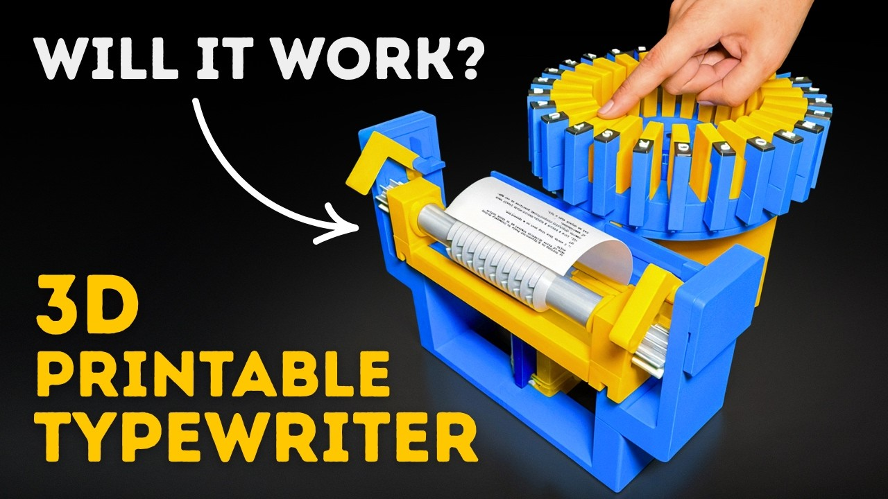
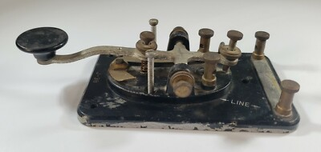

# PM3D-2526-MorseCodeTyper

## Abstract

Se numește defapt Telegraph Key, dar nu ar fi un proiect de al meu dacă nu aș începe prin a da numele greșit. Ideea este simplă: un braț mult prea complicat v-a fi apăsat de către utilizator, în funcție de lungimea apăsării vom avea 3 cazuri: spațiu, punct, sau linie. Apăsarea brațului v-a avea 2 efecte: v-a coborâ o ștampilă care v-a scrie codul, și v-a mișca foaia în stânga cu o căsuță ca să permită scrierea unui semn nou.

De ce am ales să fac acestă contrapție? Simplu! O mașină de scris mi se părea prea complicat, această alternativă părea mult mai simplă. Odată ce te gândești la toate schimbările necesare ca să transformi ce este practic două fire care își pierd contactul ca să trimită mesaje, în o mașină de scris cu o singură tastă, îți dai poate seama că nu este atât de ușor. Dar zarurile au fost aruncarte și sunt decis să o fac.

## Introducerea Ideii

Cum am zis mai sus ideea originală era un Type Writer, și prima căutare a dat acest frumos videoclip care a trimis un mesaj simplu: *`NU!`*

Așadar luăm următoarea idee:

*Probleme:*
- Trebuie să *iterez* prin hârtie. Rezolvare: vom da unroll la un termal paper roll, vom transfera mișcarea liniară în mișcare rotativă. Mai sunt probleme dar deocamdată asta este ideea principală
- Brațul trebuie să se ridice automat după apăsare. Rezolvare: Elastice, mai ușor de proiectat pentru ele decât arcuri și mai puțin de căutat după ce am nevoie.
- Când apăs brațul  trebuie să coboare și celălalt capăt, nu să urce. Un telegraph key funcționează prin separareacontactelor fizice, eu am venoie să fac contact fizic cu hârtia. Posibile rezolvăriȘ
  1. Sistem de 2 brațe. Mecanismul este practic mirrored, ai două maini care se unesc. când apăs pe partea apropiată de mine partea depărtată de mine a acelui braț se ridică cea ce face să se ridice jumătatea apropiată a celui de al doile braț cea ce coboră partea depărtată a acestuia. Prea Complex
  2. Cu Gear-uri, am două brațe conectate prin gear-uri, când apăs pe unul celălalt coboară, mai simplu, dar pot mai bine.
  3. Doar o ștampilă cu . și -. Bucata pe care o apăs este legată direct de ștampilă. Probabil cea pe care o să o implementez
- Trebuie să pot să mă duc de la . la - bazat pe presiune. Rezolvare: capul care ștampilează este format din două părți. Atunci când apeși doar de . vei face contact între foaie și prima bucată. Dacă continui cursa, prima bucată se va retracta în a doua până când și a doua va face contact cu foaia.
- Cum vom avea cerneală pe taste. Rezolvare: La fel ca la o ștampilă

